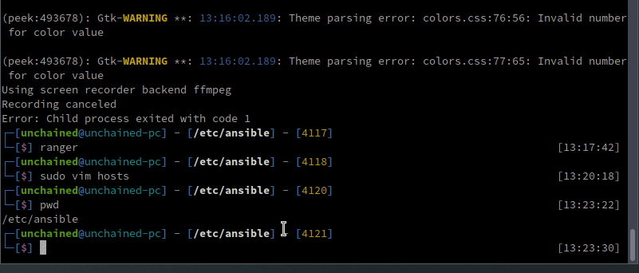

# deploy-dashmasternode
An ansible based Dashpay (Dash Cryptocurrency) Masternode Deployment
=======

deploy-dash-masternode
=========

This role automatically deploys a DASH masternode or fleet of DASH masternode servers using ansible.  Right now this role gets you to the point where The Masternode server is ready for the ProRegtx and is ready for you to notify the network about the existence of the Dash Masternode.

This role is tested on Ubuntu LTS 20.01.  I would recommend you run it on that.

This role creates a 'dashadmin' user that handles all administrative work  and a normal 'dash' user. It locks down root SSH access as well as via  passwords and only allows access via SSH for the 'dashadmin' user and normal 'dash' user. 

access to the dash-cli or any other dash wallet access is available via the 'dash' user.

'dashadmin' user is only used for administration.
'dash' user is used for everything else.  This is to keep the server secure against access attempts against 'root'.

Requirements
------------

- Ansible: 'pip install ansible'
- SSH keys: Ansible operates via SSH keys, if you dont have ssh keys installed you will need to generate your own ssh keys.  'ssh-keygen' in your terminal and it will create a new key for you.
- A fresh Ubuntu VPS.

Role

Variables
--------------

Variables are located in `deploy-dashmasternode/defaults/main.yml`

Users: users in the system, admin user to administer the system and dash_user to install dash

`dashadmin_user: dashadmin`

`dash_user: dash`

Required packages to run and install dashcore and dashd

`required_packages: [ufw, python, virtualenv, git, unzip, pv, speedtest-cli, python-pip]`

location of where dash.conf is expected

`dashconf_file_path: /home/{{ dash_user }}/.dashcore/dash.conf`

location of where dashcore is installed

`dash_core_path: /home/{{ dash_user }}/.dashcore`

location of swapfile

`swap_file: /var/swapfile`

location of dashpay github release

`dashpay_release_url: https://github.com/dashpay/dash/releases/download/v0.15.0.0/dashcore-0.15.0.0-x86_64-linux-gnu.tar.gz`

location where dash binaries will be installed

`dashpay_install_path: /opt`

url for dashpay sentinel to install

`dashpay_sentinel_url: https://github.com/dashpay/sentinel`

path where sentinel should be installed  on the dash user remote system

`sentinel_install_path: /home/{{ dash_user }}/sentinel`

path where ansible will create the bls keys for the Masternode, used to check and backup

`bls_keys_path: ~/.blskeys`

Dependencies
------------

None.

Example Playbook
----------------
This is an example playbook.  

NOTE: `gather_facts: no` is important to have.  In building out the server we lockdown the root access to the machine.  If you have `gather_facts: yes` the script will work the very first time and give errors after that, due to the fact that it defaults to using `root` access which after the first run is locked down with no password or ssh access.

Including an example of how to use your role (for instance, with variables passed in as parameters) is always nice for users too:

    - hosts: masternodes
      gather_facts: no
      roles:
         - deploy-dashmasternode

License
-------

BSD

Author Information
------------------

An optional section for the role authors to include contact information, or a website (HTML is not allowed).
>>>>>>> 1b7cf23... First commit
